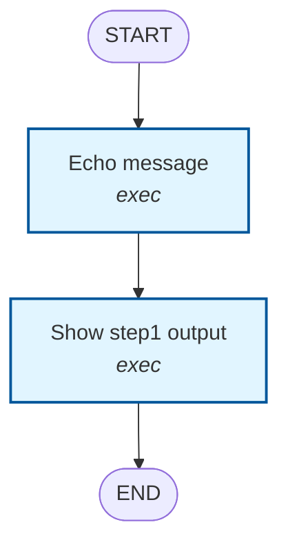

# Visualize Command

The `visualize` command generates visual representations of your workflow graph structure using LangGraph's internal graph representation.

## Usage

```bash
dagrun visualize <workflow.yaml> [options]
```

## Options

- `-o, --output <file>` - Output file path (for mermaid or png formats)
- `-f, --format <format>` - Output format: `mermaid`, `png`, or `ascii` (default: `mermaid`)

## Output Formats

### 1. Mermaid Diagram (Default)

Generates a Mermaid diagram that can be viewed in:
- GitHub (in markdown files)
- VS Code (with Mermaid extension)
- Any Mermaid-compatible viewer
- Online at [mermaid.live](https://mermaid.live)

**Example:**

```bash
# Display in terminal
dagrun visualize examples/simple-workflow.yaml

# Save to markdown file
dagrun visualize examples/simple-workflow.yaml --output workflow-graph.md
```

**Output:**



**Color Coding:**
- 🔵 **Exec nodes** - Blue (command execution)
- 🟣 **Task nodes** - Purple (agent tasks)
- 🟠 **Map nodes** - Orange (fan-out operations)
- 🟢 **Reduce nodes** - Green (fan-in operations)

### 2. ASCII Diagram

Generates a simple ASCII art representation for terminal viewing.

**Example:**

```bash
dagrun visualize examples/simple-workflow.yaml --format ascii
```

**Output:**

```
  ┌─────────┐
  │  START  │
  └────┬────┘
       │
       ▼
  ┌─────────────────┐
  │ Echo message    │
  │ [exec]          │
  └────────┬────────┘
           │
       ▼
  ┌─────────────────┐
  │ Show step1 output │
  │ [exec]          │
  └────────┬────────┘
       ▼
  ┌─────────┐
  │   END   │
  └─────────┘
```

### 3. PNG Image

Generates a PNG image using LangGraph's built-in visualization.

**Example:**

```bash
dagrun visualize examples/simple-workflow.yaml --format png --output workflow-graph.png
```

**Note:** PNG generation requires network access to render the Mermaid diagram. If it fails, use the `mermaid` format instead and render it separately.

## Examples

### Simple Linear Workflow

```bash
dagrun visualize examples/simple-workflow.yaml
```

Shows a simple two-step workflow with dependencies.

### Complex Workflow with Parallel Execution

```bash
dagrun visualize examples/file-workflow.yaml --output file-workflow.md
```

Shows a workflow with parallel execution (multiple nodes depending on the same parent).

### Map-Reduce Workflow

```bash
dagrun visualize examples/map-reduce-workflow.yaml --output map-reduce.md
```

Shows a map-reduce pattern with fan-out and fan-in operations.

## How It Works

The visualize command:

1. **Loads and validates** the workflow YAML file
2. **Builds the LangGraph** StateGraph from the workflow definition
3. **Extracts the graph structure** using LangGraph's `getGraph()` method
4. **Generates visualization** in the requested format:
   - **Mermaid**: Custom generator that creates Mermaid syntax from workflow nodes and dependencies
   - **ASCII**: Custom generator that creates ASCII art based on execution levels
   - **PNG**: Uses LangGraph's `drawMermaidPng()` method

## Benefits

- **Understand workflow structure** - Visualize dependencies and execution flow
- **Debug complex workflows** - See how nodes are connected
- **Documentation** - Generate diagrams for documentation
- **Share with team** - Export to markdown or PNG for sharing
- **Verify correctness** - Ensure the graph matches your expectations

## Integration with LangGraph

This command leverages LangGraph's internal graph representation, which means:

- ✅ The visualization reflects the **actual compiled graph** that will be executed
- ✅ Shows the **router node** and control flow logic
- ✅ Displays **START** and **END** nodes
- ✅ Accurately represents **parallel execution** paths
- ✅ Shows **conditional routing** (when implemented)

## Tips

1. **Use Mermaid for documentation** - Save to `.md` files and commit to your repository
2. **Use ASCII for quick checks** - Fast terminal-based visualization
3. **Use PNG for presentations** - Generate images for slides or reports
4. **Combine with `plan` command** - Use `plan` to see execution order, `visualize` to see structure

## Troubleshooting

### PNG generation fails

If PNG generation fails with a network error:

```bash
# Use Mermaid format instead
dagrun visualize workflow.yaml --output workflow.md

# Then render manually at https://mermaid.live
```

### Graph looks incorrect

Make sure your workflow YAML is valid:

```bash
dagrun validate workflow.yaml
```

### Nodes are missing

Check that all nodes have unique IDs and valid dependencies:

```bash
dagrun plan workflow.yaml
```

## Future Enhancements

Potential future improvements:

- [ ] Interactive HTML visualization
- [ ] SVG output format
- [ ] Highlight critical path
- [ ] Show estimated execution time per node
- [ ] Display node status from previous runs
- [ ] Integration with LangGraph Studio

