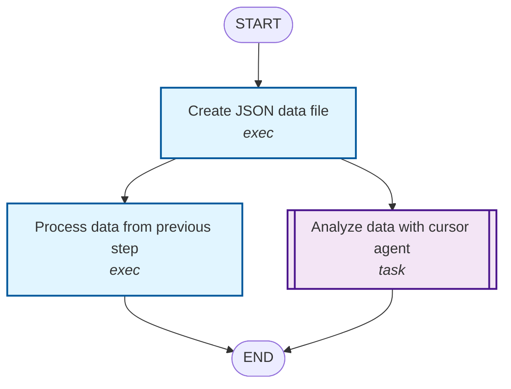

# File Workflow with Output Passing - Workflow Graph

```mermaid
graph TD
  START([START])
  create_data[Create JSON data file<br/><i>exec</i>]
  process_data[Process data from previous step<br/><i>exec</i>]
  analyze_with_agent[[Analyze data with cursor agent<br/><i>task</i>]]
  END([END])
  START --> create_data
  create_data --> process_data
  create_data --> analyze_with_agent
  process_data --> END
  analyze_with_agent --> END

  classDef execNode fill:#e1f5ff,stroke:#01579b,stroke-width:2px
  classDef taskNode fill:#f3e5f5,stroke:#4a148c,stroke-width:2px
  classDef mapNode fill:#fff3e0,stroke:#e65100,stroke-width:2px
  classDef reduceNode fill:#e8f5e9,stroke:#1b5e20,stroke-width:2px
  class create_data,process_data execNode
  class analyze_with_agent taskNode
```
