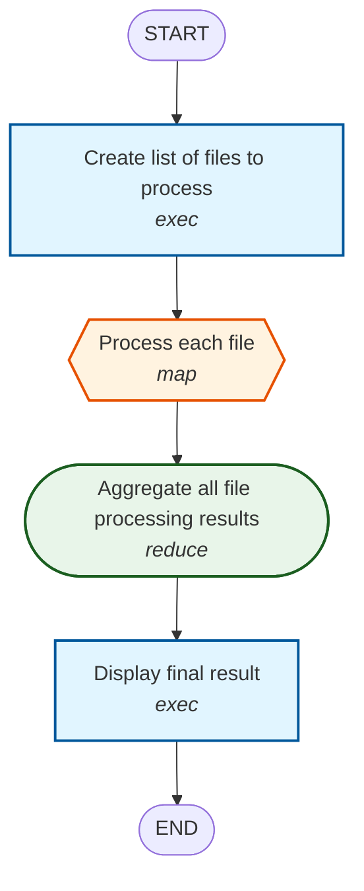

# Map-Reduce Example Workflow - Workflow Graph

```mermaid
graph TD
  START([START])
  create_files[Create list of files to process<br/><i>exec</i>]
  process_files{{Process each file<br/><i>map</i>}}
  aggregate_results([Aggregate all file processing results<br/><i>reduce</i>])
  display_result[Display final result<br/><i>exec</i>]
  END([END])
  START --> create_files
  create_files --> process_files
  process_files --> aggregate_results
  aggregate_results --> display_result
  display_result --> END

  classDef execNode fill:#e1f5ff,stroke:#01579b,stroke-width:2px
  classDef taskNode fill:#f3e5f5,stroke:#4a148c,stroke-width:2px
  classDef mapNode fill:#fff3e0,stroke:#e65100,stroke-width:2px
  classDef reduceNode fill:#e8f5e9,stroke:#1b5e20,stroke-width:2px
  class create_files,display_result execNode
  class process_files mapNode
  class aggregate_results reduceNode
```
