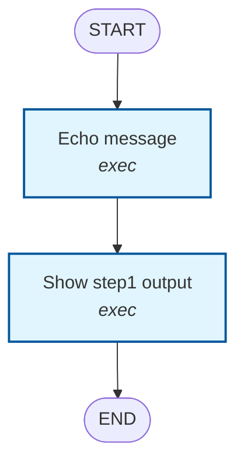

# Simple Workflow - Workflow Graph

```mermaid
graph TD
  START([START])
  step1[Echo message<br/><i>exec</i>]
  step2[Show step1 output<br/><i>exec</i>]
  END([END])
  START --> step1
  step1 --> step2
  step2 --> END

  classDef execNode fill:#e1f5ff,stroke:#01579b,stroke-width:2px
  classDef taskNode fill:#f3e5f5,stroke:#4a148c,stroke-width:2px
  classDef mapNode fill:#fff3e0,stroke:#e65100,stroke-width:2px
  classDef reduceNode fill:#e8f5e9,stroke:#1b5e20,stroke-width:2px
  class step1,step2 execNode
```
