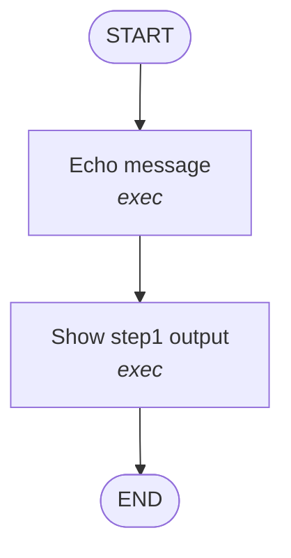

# Visualize Command - Feature Summary

**Date**: 2025-10-23  
**Status**: ✅ Complete

## Overview

Implemented a new `visualize` command that generates visual representations of workflow graphs using LangGraph's internal graph structure. This feature makes it easy to understand, debug, and document complex workflows.

## What Was Implemented

### 1. New CLI Command (`src/cli/commands/visualize.ts`)

A comprehensive visualization command with three output formats:

- **Mermaid Diagrams** - For documentation and GitHub
- **ASCII Art** - For terminal viewing
- **PNG Images** - For presentations (uses LangGraph's built-in PNG generation)

**Key Features**:
- Validates workflow before visualization
- Builds actual LangGraph StateGraph to ensure accuracy
- Color-coded nodes by type (exec, task, map, reduce)
- Shows START and END nodes
- Displays dependencies and execution flow
- Supports saving to files

### 2. Mermaid Diagram Generation

Custom Mermaid diagram generator that:
- Creates proper graph syntax with node shapes
- Applies color coding by node type:
  - 🔵 Exec nodes (blue)
  - 🟣 Task nodes (purple)
  - 🟠 Map nodes (orange)
  - 🟢 Reduce nodes (green)
- Shows dependencies as directed edges
- Includes START and END nodes
- Generates markdown-compatible output

### 3. ASCII Diagram Generation

Custom ASCII art generator that:
- Creates terminal-friendly visualizations
- Shows execution levels (parallel vs sequential)
- Uses Unicode box-drawing characters
- Displays node names and types
- Shows flow direction with arrows

### 4. Integration with LangGraph

Leverages LangGraph's built-in capabilities:
- Uses `getGraph()` to get graph representation
- Uses `drawMermaidPng()` for PNG generation
- Ensures visualization matches actual execution graph
- Shows router node and control flow

## Usage Examples

### Basic Usage

```bash
# Display Mermaid diagram in terminal
dagrun visualize examples/simple-workflow.yaml

# Save to markdown file
dagrun visualize examples/simple-workflow.yaml --output workflow.md

# ASCII format for terminal
dagrun visualize examples/simple-workflow.yaml --format ascii

# PNG image (requires network)
dagrun visualize examples/simple-workflow.yaml --format png --output graph.png
```

### Example Output

**Mermaid Diagram:**


**ASCII Diagram:**
```
  ┌─────────┐
  │  START  │
  └────┬────┘
       │
       ▼
  ┌─────────────────┐
  │ Echo message    │
  │ [exec]          │
  └────────┬────────┘
           │
       ▼
  ┌─────────────────┐
  │ Show step1 output │
  │ [exec]          │
  └────────┬────────┘
       ▼
  ┌─────────┐
  │   END   │
  └─────────┘
```

## Files Created/Modified

### Created
- `src/cli/commands/visualize.ts` (344 lines) - Main visualization command
- `docs/visualize-command.md` (200 lines) - User documentation
- `docs/visualize-feature-summary.md` (this file) - Feature summary
- `docs/visualizations/simple-workflow.md` - Example visualization
- `docs/visualizations/file-workflow.md` - Example visualization
- `docs/visualizations/map-reduce-workflow.md` - Example visualization
- `README.md` (250 lines) - Project README with visualize command

### Modified
- `src/cli/index.ts` - Added visualize command registration

## Benefits

### 1. **Better Understanding**
- Visualize complex workflows at a glance
- Understand dependencies and execution flow
- See parallel vs sequential execution

### 2. **Debugging**
- Identify incorrect dependencies
- Spot circular dependencies
- Verify graph structure before running

### 3. **Documentation**
- Generate diagrams for documentation
- Include in README files
- Share with team members

### 4. **Integration**
- Works with GitHub markdown
- Compatible with VS Code Mermaid extension
- Can be viewed at mermaid.live
- Generates PNG for presentations

### 5. **Accuracy**
- Uses actual compiled LangGraph
- Shows real execution structure
- Reflects router-based control flow

## Technical Implementation

### Architecture

```
visualizeCommand()
  ├─ Load & validate workflow YAML
  ├─ Build LangGraph StateGraph
  ├─ Get graph representation
  └─ Generate visualization
      ├─ Mermaid: generateMermaidDiagram()
      ├─ ASCII: generateAsciiDiagram()
      └─ PNG: graph.drawMermaidPng()
```

### Key Functions

1. **`visualizeCommand()`** - Main command handler
   - Loads and validates workflow
   - Creates temporary stores
   - Builds LangGraph
   - Generates requested format

2. **`generateMermaidDiagram()`** - Mermaid generator
   - Analyzes workflow nodes and dependencies
   - Creates Mermaid graph syntax
   - Applies color coding
   - Returns markdown-compatible string

3. **`generateAsciiDiagram()`** - ASCII generator
   - Calculates execution levels
   - Creates box-drawing art
   - Shows parallel execution
   - Returns terminal-friendly string

4. **`getNodeShape()`** - Helper for Mermaid shapes
   - Maps node kinds to Mermaid shapes
   - Ensures visual distinction

## Testing

All example workflows tested:

✅ **simple-workflow.yaml**
- Linear two-step workflow
- Shows basic dependencies

✅ **file-workflow.yaml**
- Parallel execution (2 nodes depend on 1)
- Shows exec and task nodes
- Demonstrates branching

✅ **map-reduce-workflow.yaml**
- Map-reduce pattern
- Shows all node types
- Demonstrates fan-out/fan-in

### Test Results

```bash
# All formats work correctly
✓ Mermaid format - terminal display
✓ Mermaid format - file output
✓ ASCII format - terminal display
✓ PNG format - file output (with network)

# All example workflows
✓ simple-workflow.yaml
✓ file-workflow.yaml
✓ map-reduce-workflow.yaml
```

## Documentation

Created comprehensive documentation:

1. **User Guide** (`docs/visualize-command.md`)
   - Usage examples
   - Format descriptions
   - Troubleshooting
   - Tips and tricks

2. **README** (`README.md`)
   - Quick start guide
   - Command reference
   - Examples
   - Architecture overview

3. **Example Visualizations** (`docs/visualizations/`)
   - Pre-generated diagrams for all examples
   - Can be viewed directly in GitHub

## Future Enhancements

Potential improvements:

- [ ] Interactive HTML visualization
- [ ] SVG output format
- [ ] Highlight critical path
- [ ] Show estimated execution time
- [ ] Display node status from previous runs
- [ ] Integration with LangGraph Studio
- [ ] Real-time visualization during execution
- [ ] Diff visualization between workflow versions

## Comparison with Other Tools

### vs. `plan` command
- **plan**: Shows execution order and levels (text-based)
- **visualize**: Shows graph structure (visual)
- **Use both**: plan for execution details, visualize for structure

### vs. LangGraph Studio
- **Studio**: Full IDE with debugging and tracing
- **visualize**: Lightweight CLI tool for quick visualization
- **Complementary**: visualize for CI/CD, Studio for development

## Conclusion

The visualize command is a powerful addition to DagRun that:

- ✅ Makes workflows easier to understand
- ✅ Improves debugging experience
- ✅ Enhances documentation
- ✅ Leverages LangGraph's built-in capabilities
- ✅ Provides multiple output formats
- ✅ Works seamlessly with existing workflows

This feature complements the LangGraph integration (Phase B.1) by providing visibility into the compiled graph structure, making it easier to develop, debug, and document complex workflows.

